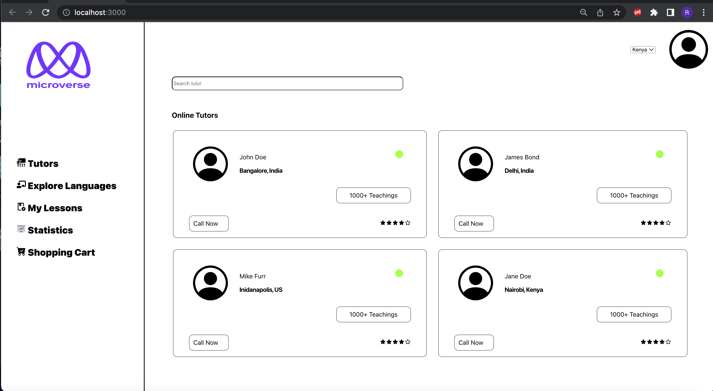

# Tutors App

> A React/Redux full-stack app for managing Tutors.




## Built With

- React 18.2.0
- React-redux 8.0.2
- React-bootstrap 2.4.0
- JavaScript
## Live demo

## Getting Started

Follow these steps:

### Prerequisites

Have the following correctly installed.
- Node.js & NPM
- Git


### Setup

- Open a terminal window where you want to have installed a clone of the repository.

### Install

- Use this command to clone the repo:
```
$ git clone https://github.com/richardoppiyo/tutors.git
```
- Install the required dependencies:
```
$ npm install
``

- Run the frontend server on the specified port:
```
$ PORT=3001 npm start
```
- Build:
```
$ npm run build
```

## Authors

👤 **Richard Opiyo**

- GitHub: [@richaroppiyo](https://github.com/richardoppiyo)
- Twitter: [@blessed_ricky](https://twitter.com/blessed_ricky)
- LinkedIn: [LinkedIn](https://www.linkedin.com/in/richardoppiyo/)


## 🤝 Contributing

Contributions, issues, and feature requests are welcome!

Feel free to check the [issues page](../../issues/).

## Show your support

Give a ⭐️ if you like this project!


## 📝 License

This project is [MIT](./MIT.md) licensed.
